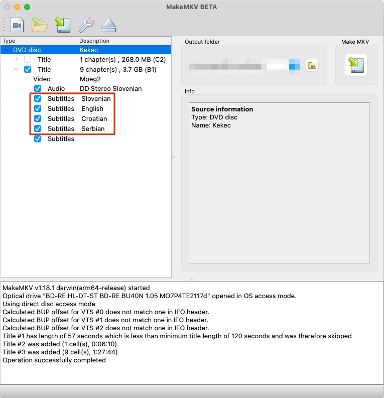
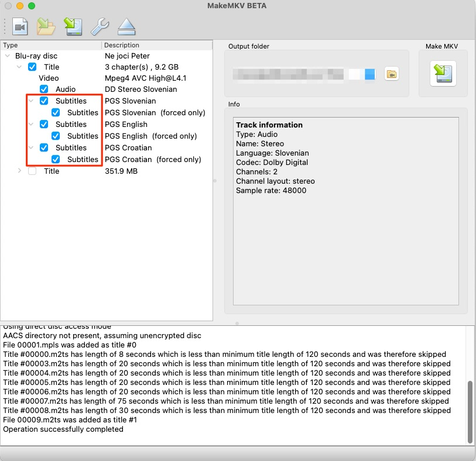
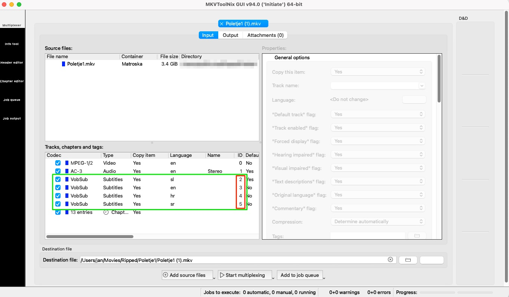

# DVD/Blu-ray Subtitle Extraction Guide

This guide covers the complete workflow for backing up DVDs/Blu-ray discs and extracting subtitles for conversion to SRT format.

## Prerequisites

You'll need the following software installed:
- **MakeMKV** - For disc backup
- **MKVToolNix** - For subtitle extraction
- **Web browser** - For online subtitle conversion

## Step 1: Install MakeMKV

### All Platforms
1. Download MakeMKV from [official website](https://www.makemkv.com/download/)
2. Install following the platform-specific instructions
3. Launch MakeMKV and insert your DVD/Blu-ray disc

### Usage
1. Insert disc and wait for MakeMKV to scan
2. Select titles you want to backup
3. Select subtitles as well
4. Choose output directory
5. Click "Make MKV" to create backup files
6. Wait for completion - you'll get `.mkv` files





## Step 2: Install MKVToolNix

### macOS (via MacPorts)
```bash
# Install MacPorts first from https://www.macports.org
sudo port install mkvtoolnix
```

### macOS (via Homebrew)
```bash
brew install mkvtoolnix
```

### Windows
1. Download from [MKVToolNix website](https://mkvtoolnix.download/downloads.html)
2. Run the installer
3. Add to PATH if needed

### Linux (Ubuntu/Debian)
```bash
sudo apt update
sudo apt install mkvtoolnix mkvtoolnix-gui
```

### Linux (CentOS/RHEL/Fedora)
```bash
# Fedora
sudo dnf install mkvtoolnix mkvtoolnix-gui

# CentOS/RHEL (enable EPEL first)
sudo yum install epel-release
sudo yum install mkvtoolnix mkvtoolnix-gui
```

## Step 3: Extract Subtitles

### Identify Subtitle Tracks
First, examine your MKV file to see available subtitle tracks by opening MKVtoolNix and note down subtitles IDs you see:



### Extract Subtitle Tracks

**For DVD backups (VobSub format - .sub/.idx files):**
```bash
mkvextract tracks "MovieDVD.mkv" 2:MovieDVD_sl.sub 3:MovieDVD_hr.sub 4:MovieDVD_sr.sub 5:MovieDVD_en.sub 6:Varuh_meje_de.sub
```

You get two files for each language for example:

```bash
- MovieDVD_sl.sub
- MovieDVD_sl.idx
```

**For Blu-ray backups (PGS format - .sup files):**
```bash
mkvextract tracks "MovieBluray.mkv" 2:MovieBluray_sl.sup 3:MovieBluray_en.sup 4:MovieBluray_de.sup
```

You get one file for each language for example:

```bash
- MovieBluray_sl.sup
```

## Step 4: Convert to SRT Format

### Online Conversion (Recommended)
1. Visit [SubtitleTools.com](https://subtitletools.com)
2. Upload your extracted subtitle files (.sub/.idx or .sup)
3. Select "Convert to SRT"
4. Download the converted SRT files

### File Format Notes
- **DVD subtitles**: Upload both `.sub` and `.idx` files together
- **Blu-ray subtitles**: Upload the `.sup` file
- The online tool uses OCR (Optical Character Recognition) to convert image-based subtitles to text

## Troubleshooting

### Common Issues

**"Could not detect subtitle format"**
- Ensure you have both .sub and .idx files for DVD subtitles
- Check that files aren't corrupted
- Verify track numbers with `MKVtoolNix`

**Missing subtitle tracks**
- Some discs have subtitle tracks that aren't enabled by default in MakeMKV
- Check MakeMKV settings and ensure all subtitle tracks are selected during backup

**OCR accuracy issues**
- Higher quality source material produces better OCR results
- Manual correction may be needed for stylized fonts or poor quality sources
- Consider using desktop OCR software for better control

## File Extensions Reference

| Format | Extension | Source | Notes |
|--------|-----------|--------|-------|
| VobSub | .sub + .idx | DVD | Image-based, needs OCR |
| PGS | .sup | Blu-ray | Image-based, needs OCR |
| SRT | .srt | Converted | Text-based, universal |

---

**Note**: This process converts image-based subtitles to text format. OCR accuracy may vary depending on source quality and font styles. Always review converted subtitles for errors. 

**Legal notice**: This process is intended only to backup your legally obtained DVDs and Blu-rays.